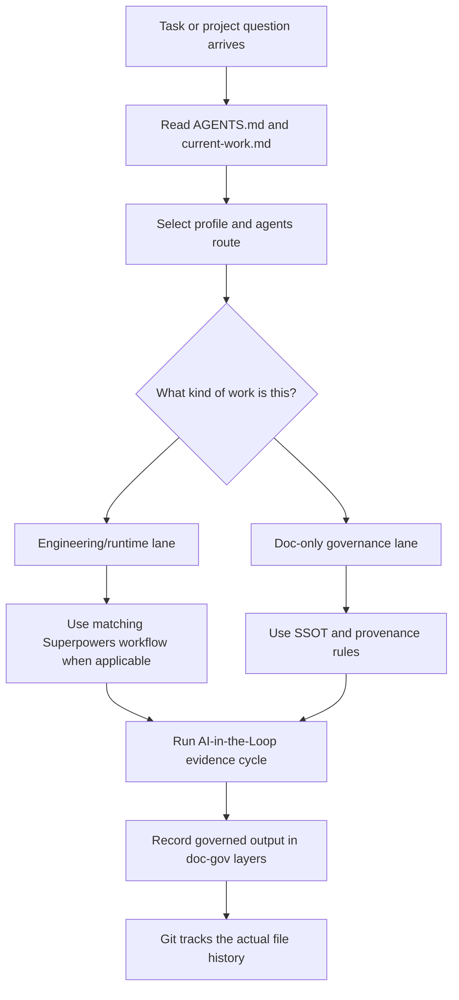

# Project Governance System

[](https://github.com/PieAIStudio/project-governance-system/actions/workflows/docs-check.yml)

AI-native documentation governance, agents routing, and workflow integration profiles for projects that work with AI agents over time.

This repository is the upstream home of the Project Governance System and the `@pieai/doc-gov` CLI package target. It defines the thin shared rules that PieAI projects use to keep AI-generated plans, specs, decisions, references, and routing instructions from turning into unmanaged clutter.

This root README is for humans. AI agents should use `AGENTS.md` as their startup entrypoint and only read this README when the task is about project positioning, public explanation, or the README itself.

## Positioning

Project Governance System is an **AI-native governance layer for project documentation and agent work artifacts**.

It does not replace Git, AGENTS.md, or Superpowers:

- Git records file history: what changed, when, and by whom.
- AGENTS.md gives project-specific instructions to coding agents.
- Superpowers provides engineering workflows such as brainstorming, TDD, debugging, planning, and verification.
- Project Governance System decides where durable AI-created governance artifacts belong, what counts as current truth, which workflow depth an agent task needs, and how finished or stale governed documents retire.

Beginner version:

> Git is the storage and history system. Superpowers is the engineering playbook. Project Governance System is the project librarian and traffic desk: it tells agents where governed docs belong, which shelf is current, which route to take, and when old governed material belongs in the archive.

This matters because AI agents can create useful specs, plans, decisions, and research quickly, but without a lifecycle those files become clutter. The goal is not more ceremony. The goal is one clear place for current governed truth, one small agents-routing layer for task depth, and one validation layer that keeps AI-generated documentation from piling up into noise.



## Quick Start

For a local checkout:

```bash
pnpm install
pnpm build
pnpm doc-gov doctor
```

For a project that wants to evaluate adoption without changing files:

```bash
pnpm dlx @pieai/doc-gov migrate --profile doc-only --check
pnpm dlx @pieai/doc-gov migrate --profile engineering-runtime --check
```

If the npm package is not available in your environment yet, run the same commands from a clone:

```bash
node /path/to/project-governance-system/packages/doc-gov/dist/cli.js doctor
```

## Start Here By Role

Use this table before trying to understand the whole repository.

| If you are... | Read first | Goal |
| --- | --- | --- |
| New to this system | `README.md`, `docs/policy/design-principles.md`, `docs/reference/adoption/project-relationship.md` | Understand what this repo is and what it is not |
| Adopting it into a project | `docs/reference/adoption/adoption-playbook.md`, `profiles/engineering-runtime/profile.md` or `profiles/doc-only/profile.md`, `starter/` | Copy the right shape without copying project-local truth |
| Editing doc-gov rules | `docs/governance/boundary.md`, `packages/doc-gov/cli-guide.md`, `docs/policy/upstreaming-policy.md` | Change core rules in the upstream repo first |
| Editing agents routing | `docs/governance/agents-routing/engineering-runtime-v0.9.md`, `docs/governance/agents-routing/doc-only-v0.9.md`, `integrations/superpowers.md` | Keep routing separate from current work and external workflow execution |
| Deciding where a file belongs | `starter/docs/reference/documentation-map.md`, `docs/governance/boundary.md`, `docs/governance/ssot-v0.9.md` | Put durable information on the right shelf |

## What This System Answers

| Question | Answered by |
| --- | --- |
| Where should an AI-generated spec, plan, decision, or reference go? | `doc-gov`, `starter/`, and project-local `docs/` layers |
| Which document is current truth? | frontmatter, `canonical`, lifecycle status, and `current-work.md` |
| Should this task be lightweight, doc-only, TDD, or Directed Development? | `docs/governance/agents-routing/` plus the project-local lane profile |
| Should Superpowers run here? | the selected profile and `integrations/superpowers.md` |
| Is the router/profile/Superpowers wiring still connected? | `doc-gov router-check` |
| Is this project really wired, not just documented? | `doc-gov doctor` |
| Is this project structurally ready for a selected profile? | `doc-gov migrate --profile <profile> --check` |
| What happens after a plan is done? | `completed` status and completed folders, not active-plan pileup |
| What stays local to a product project? | project-local canon, runtime truth, product artifacts, verification ladders, and lane wording |

## What Belongs Here

| Layer | Purpose | Example |
| --- | --- | --- |
| `packages/doc-gov/` | CLI, schema, lifecycle, templates, validation logic | `completed` status, manifest scan, link checks |
| `starter/` | New-project starter files | `docs/`, `docs/governance/`, `AGENTS.template.md` |
| `docs/governance/` | Governance core rules | SSOT, doc types, agents routing, manifest |
| `integrations/` | How this system cooperates with external workflows | Superpowers, Directed Development |
| `profiles/` | Optional adoption profiles by project type | engineering-runtime, doc-only |
| `examples/` | Reference implementation notes | Supa, PieFlow, PieIP |

## What Does Not Belong Here

- Supa Phase03 gameplay truth.
- PieFlow v4 product rules.
- PieIP character, script, or asset canon.
- Product prompts, generated media notes, source assets, or project-package workbench files.
- Copies of external shared AI work rules. Target projects may link those inside
  their docs/policy/shared-rules folder, but this repo does not keep their
  bodies.
- A fork or copy of the Superpowers plugin.
- The body of the Directed Development skill.

Those are project-local or external systems. This repo only defines how projects should integrate with them.

## Current Adoption Model

The system is moving from Stage 0 into package-based distribution. The safe rule is:
use the package for the CLI, but migrate each project's files intentionally.

1. This repo records the upstream contract.
2. The npm package can supply the `doc-gov` command once installed.
3. AI-assisted migrations compare a project against the matching profile.
4. `doc-gov migrate --profile <profile> --check` can now do the first read-only
   structural check before any sync work.
5. `doc-gov doctor` checks whether router, docs, manifest, links, local hooks,
   and CI guardrails are actually connected.
6. Downstream projects should switch from local `tools/doc-gov` copies to the
   package only when they are ready to update their scripts and CI together.

Do not silently replace project-local governance with this repo. Use the adoption guides and run each project's doc checks.

For migration steps, read `docs/reference/adoption/adoption-playbook.md`.

## Starter Template Vision

This repo can become a new-project starter for AI-assisted work, but only in stages:

1. Today: use it as the upstream design and compare projects against the matching profile.
2. Now: use `doc-gov migrate --profile <profile> --check` and `doc-gov doctor`
   to find drift without changing files.
3. Next: install `@pieai/doc-gov` as the CLI source in projects that are ready
   to leave vendored `tools/doc-gov` copies behind.
4. Later: add a safe `migrate --apply` path only after repeated projects show
   the same sync shape.
5. Later: publish full init profiles for new projects.

Do not treat the starter as a magic install. A useful project still needs local truth: its product canon, runtime proof commands, asset provenance rules, product-package folders, and current work index. The central system supplies the governed shelves and guardrails; each project supplies the actual content.

## Project Profiles

| Project | Profile | Uses agents-routing? | Uses Directed Development? |
| --- | --- | --- | --- |
| Supa | `profiles/engineering-runtime/` plus Supa-local game rules | Yes, engineering agents routing | Yes, for mixed product/runtime work |
| PieFlow | `profiles/engineering-runtime/` | Yes, engineering agents routing | Yes, for mixed app/runtime work |
| Non-Heroes | `profiles/engineering-runtime/` | Yes, engineering agents routing | Yes, for mixed app/runtime work |
| Show | `profiles/engineering-runtime/` | Yes, engineering agents routing | Yes, for cross-domain features |
| PieHQ | `profiles/doc-only/` | Yes, doc-only agents routing | No by default |
| PieIP | `profiles/doc-only/` | Yes, doc-only agents routing | No by default |

## Key Lifecycle Decision

Normal documents use:

```text
draft -> active -> completed -> stable -> superseded -> archived
```

`completed` is for execution artifacts that finished but remain useful as proof history, especially `docs/plans/completed/**`.

`completed` is not the same as `archived`:

- `completed`: no longer active, still useful proof/history, may remain canonical.
- `archived`: retired historical material, must be `canonical: false`.

Decision documents still use:

```text
proposed -> accepted -> rejected | superseded
```

## How A Local Improvement Flows Upstream

When a project discovers a better rule:

1. Decide whether it is **core**, **profile**, or **project-local**.
2. Core changes go to this repo first.
3. Profile changes update `profiles/**`.
4. Project-local changes stay in the project.
5. Other projects upgrade by comparing against the central profile, not by re-inventing the rule.

Example: Supa's active-plan pileup revealed a core lifecycle gap. The fix is `completed`, so it belongs in `packages/doc-gov/` and the starter templates, not only in Supa.

## Minimality Rule

This repo should remain a thin viable platform:

- keep only two profiles until a third is proven by multiple projects
- keep product/game/app truth out of the central repo
- keep Superpowers external and documented as an integration
- keep Directed Development as an optional workflow integration, not a mandatory default path
- prefer one-page agents-routing rules over layered methodology docs
