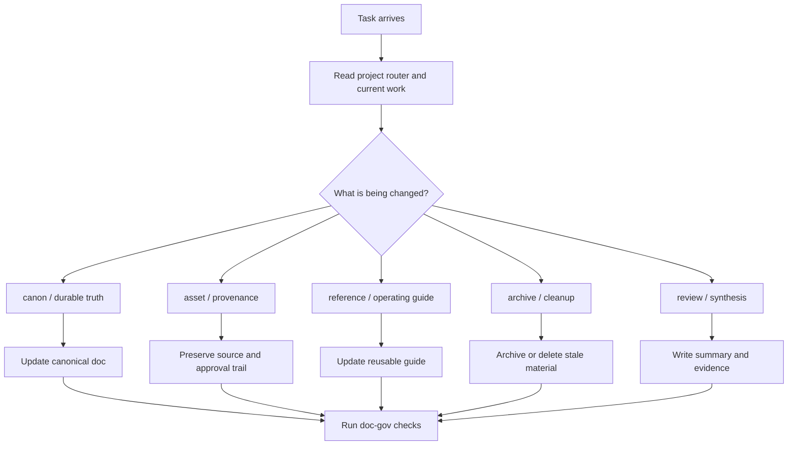

# Doc-Only Agents Routing v0.9

Shared routing algorithm for non-runtime projects such as AI media, IP development, research, and asset governance workspaces.

This route does not use Superpowers TDD or Directed Development by default.

## Core Flow

## Rules

- Do not ask whether the task needs TDD unless the project has actual runtime code.
- Do not trigger Directed Development unless the project explicitly opts in.
- Prefer SSOT, provenance, and approval clarity over engineering ceremonies.
- Use AI-in-the-Loop for evidence: inspect source, change one thing, verify the target document or asset path.

## Typical Lanes

- canon truth
- asset intake and promotion
- production/reference guide
- archive and cleanup
- research synthesis

The local project decides exact lane names.

## Product Artifact Boundary

Doc-only projects often produce Markdown, prompts, images, scripts, bibles,
reference packs, and asset manifests as product artifacts.

Those artifacts do not become governed `docs/**` files just because they are
written as Markdown. Governed docs record decisions, plans, references, policies,
and workspace truth. Product artifacts stay in the project package or workbench
unless the project explicitly opts them into doc-gov.

## External Workflow Boundary

This route runs before external workflow systems such as Superpowers or GStack.
Host-specific files such as `CLAUDE.md` or `GEMINI.md` may adapt the route for a
specific AI client, but they must not replace the project `AGENTS.md` route.
