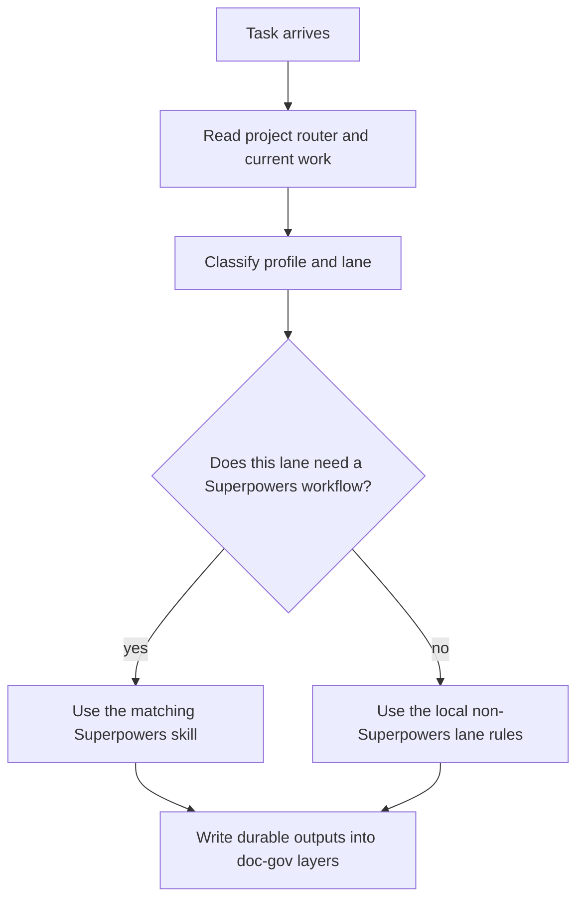

# Superpowers Integration

Superpowers is an external plugin/system. This repository does not vendor or rewrite it.

## Boundary

Superpowers owns engineering workflows such as:

- brainstorming
- writing plans
- TDD
- debugging
- verification before completion
- worktree usage

Project Governance System owns:

- documentation lifecycle
- agents routing
- current work index conventions
- shared AI evidence rules

## Rule

Use Superpowers inside the selected project lane. Do not let Superpowers create a separate durable document tree unless the project explicitly adopts one.

Durable outputs should map back to the project's doc-gov layers:

- specs -> `docs/specs/**`
- plans -> `docs/plans/**`
- durable references -> `docs/reference/**`

## Execution Order

Agents routing classifies first. Superpowers executes inside the selected lane.

If Superpowers suggests a default location such as `docs/superpowers/**`, project instructions may override that location. The durable project record should still land in the governed doc-gov layer unless the project has explicitly adopted a separate Superpowers document tree.

Host-specific files such as `CLAUDE.md` may include Superpowers skill routing
text. That text is an adapter. It must not replace the project `AGENTS.md`
router or run before the Project Governance System routing block.
