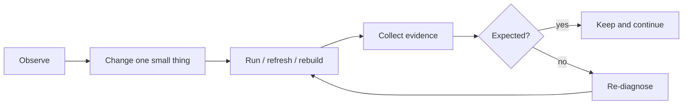

# AI-in-the-Loop

Shared evidence loop for AI work.

## Core Loop

## Rules

- Observe before editing.
- Prefer one small change per loop.
- Pick one primary verification lane per loop.
- Re-observe after navigation, reload, state changes, or generated output.
- Do not claim completion without fresh evidence.

## Boundary

This rule owns the evidence loop only. Task classification lives in agents-routing files. Project truth lives in the project docs and runtime.
